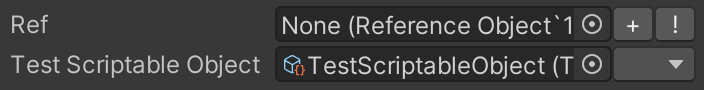

# Scriptable Object Drawer

A custom drawer for scriptable object fields in the inspector.

When no object is selected two buttons are drawn next to the object field: `+` (create) and a `!` (guess).

The create button will prompt the user for a location and create an asset of the scriptable object type there. When multiple types apply, a popup is shown to select the preferred object type.

The guess button tries to select a viable asset of the desired asset type. In case of multiple viable candidates, it tries to guess the best one.

When an object is selected the buttons change into a dropdown (`▼`) that will show the editor for the selected object inline, in a popup. 