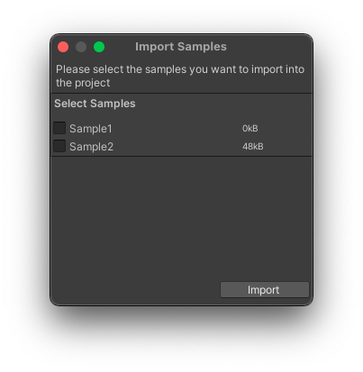
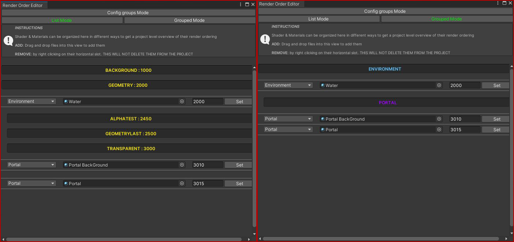

# Tools

## Screenshot Tool

Take a quick screenshot from the scene view. The screenshots are stored in the root of the project using a timestamped format.

## Pinned Editor Window

Pinned editor windows keep the editor for an asset open, persisting trough assembly reloads and
usually even editor restarts. Very useful if there is a settings object or prefab that you edit
or refer to frequently.

Note that in Unity 2020+ the confusingly named "properties" (`Assets/Properties...`) window was added which does more or
less the same thing.

Accessed from the context menu or via the Assets menu.

## Samples Importer

A local version of the package samples importer. Lists the samples, i.e. subdirectories, in the project's `Assets/Samples~/` folder that can be imported into the project.

The most common use case for project sample is to show how a project specific tool can be used or set up without littering the (built) project with test scenes and scripts.

> The `/Assets/Samples/` folder is also used by the package samples and is likely to be ignored by git (it should), or to be deleted without much consideration. Do not place anything essential to the project in the Samples folders.

## Render Order Editor

List/Bundle shader & material files to keep an better overview of the order in which they render.

Material renderqueues can be directly edited in this view, allowing you to make changes relative to other materials and shaders more easiliy